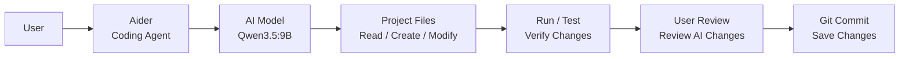

# Local AI Setup | AI Assistant Tools

**This documentation is created for personal learning and reference.**<br>
Below is the details information.

- Created: Hazmi Hashim | 10 September 2026
- Last Update: 10 September 2026

## Purpose
The objective is to build a fully local AI assistant environment for software development, using locally hosted AI models.
The AI models run locally on the PC and utilize the NVIDIA GPU for inference. Aider is used as the coding agent to interact 
with the project files, including reading, creating, modifying, and managing files within a selected project directory.

## The setup consists of:

- Ollama — Local AI model runtime
- Qwen3.5:9B — Local AI coding model
- Aider — AI coding agent
- Git — Version control
- GPU [RTX5070 12GB | OC Edition]

## Simple Flow



## Setup Steps

## 1. Install Ollama

Install Ollama using PowerShell:

```powershell
irm https://ollama.com/install.ps1 | iex
```

Verify the installation:

```powershell
ollama --version
```

Check GPU availability:

```powershell
nvidia-smi
```

---

## 2. Install Qwen3.5:9B

Download the AI model:

```powershell
ollama pull qwen3.5:9b
```

Check installed models:

```powershell
ollama list
```

Test the model:

```powershell
ollama run qwen3.5:9b
```

Exit the model:

```text
/bye
```

---

## 3. Install Aider

Install Aider:

```powershell
python -m pip install aider-install
```

Then run:

```powershell
aider-install
```

Restart PowerShell after installation.

Verify the installation:

```powershell
aider --version
```

---

## 4. Connect Aider to Ollama

Set the Ollama API address:

```powershell
setx OLLAMA_API_BASE http://127.0.0.1:11434
```

Restart PowerShell after running the command.

Verify the environment variable:

```powershell
$env:OLLAMA_API_BASE
```

Expected output:

```text
http://127.0.0.1:11434
```

---

### 5. Create Project Directory

Create a project directory under the `C:\Users` directory.

Example:

```powershell
cd C:\Users
mkdir Testing
cd C:\Users\Testing
```

Project location:

```text
C:\Users\Testing
```

---

### 6. Initialize Git

Inside the project directory:

```powershell
cd C:\Users\Testing
```

Initialize Git:

```powershell
git init
```

Check Git status:

```powershell
git status
```

---

### 7. Start Aider

Start Aider from the project directory:

```powershell
cd C:\Users\Testing
aider --model ollama_chat/qwen3.5:9b
```

Aider will now use **Qwen3.5:9B** through **Ollama**.

---

### 8. Test AI Coding

Once Aider is running, give it a simple instruction:

```text
Create a Python hello world application.
```

Aider can create the required file automatically.

Example project structure:

```text
C:\Users\Testing
└── hello.py
```

Aider can also create folders and organize the project:

```text
Create a folder named src and move hello.py into it.
```

Result:

```text
C:\Users\Testing
├── src
│   └── hello.py
└── .git
```

---

### 9. Review Changes

Before committing AI-generated changes, check the Git status:

```powershell
git status
```

Review the actual changes:

```powershell
git diff
```

If everything looks correct:

```powershell
git add .
```

Commit the changes:

```powershell
git commit -m "Update project"
```

---

### 10. Run / Test the Application

For example, if the project contains:

```text
C:\Users\Testing\src\main.py
```

Run:

```powershell
python C:\Users\Testing\src\main.py
```

Alternatively, when already inside the project directory:

```powershell
cd C:\Users\Testing
python src\main.py
```

Test the application and verify that the changes work as expected.
